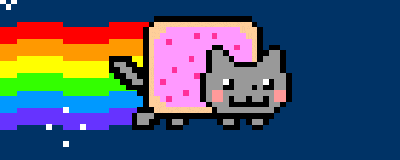
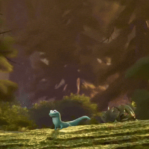

<p align="center">
  
</p>

<p align="center">
  
</p>

<h1 align="center">
Hi 👋 I'm TamaDev
</h1>

<h3 align="center">
💻 Software Engineering Student • Flutter • React • Laravel
</h3>

<p align="center">
<p align="center">
  
</p>
</p>

<p align="center">


</p>

---

## 👨‍💻 About Me

- 🎓 Vocational High School Student (Software Engineering)
- 🌍 Yogyakarta, Indonesia 🇮🇩
- 💙 Passionate about Web Development & Mobile Apps
- 🎨 Interested in UI/UX Design
- 🌱 Currently learning Flutter, React, Laravel & Cybersecurity
- 🚀 Building useful applications every day
- 🎯 Goal: Become a Full Stack Developer

<br clear="right"/>

---

## ⚡ Developer Setup

<table align="center">
<tr>

<td align="center">

### 💻 Operating System


Windows 11  
WSL Ubuntu

</td>

<td align="center">

### 🛠 IDE & Tools


VS Code  
Android Studio  
Figma

</td>

</tr>
</table>

<br>

<p align="center">


</p>

---

---

## 📊 GitHub Analytics

<p align="center">


</p>

<p align="center">


</p>

---

## 📈 Contribution Graph

<p align="center">


</p>

---

## 🐍 Contribution Snake

<p align="center">


</p>

---

## 📌 Current Focus

```text
📱 Building Flutter Applications
⚛️ Learning React Ecosystem
🎨 Improving UI/UX Design
🔐 Exploring Cybersecurity
🤝 Open Source Collaboration
```

---

## 🌐 Connect With Me

<p align="center">

<a href="https://github.com/TamaDev-student">

</a>

<!-- Ganti dengan akunmu jika sudah punya -->
<a href="https://www.linkedin.com/">

</a>

<!-- Ganti dengan emailmu -->
<a href="mailto:your@email.com">

</a>

</p>

---

<p align="center">


</p>

<h3 align="center">
 Keep Learning • Keep Building • Keep Improving
</h3>

<p align="center">
Made with by TamaDev
</p>

